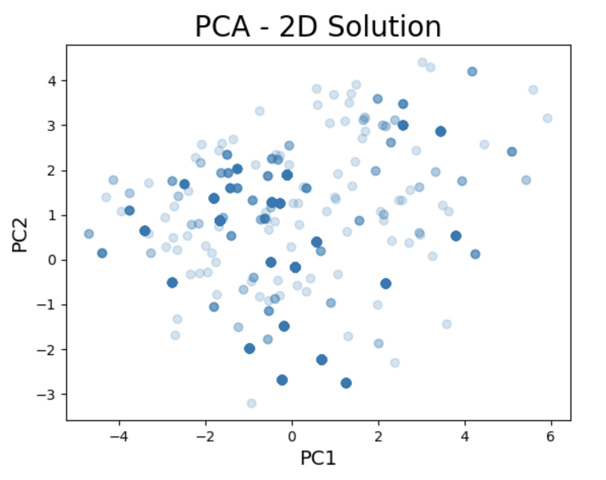
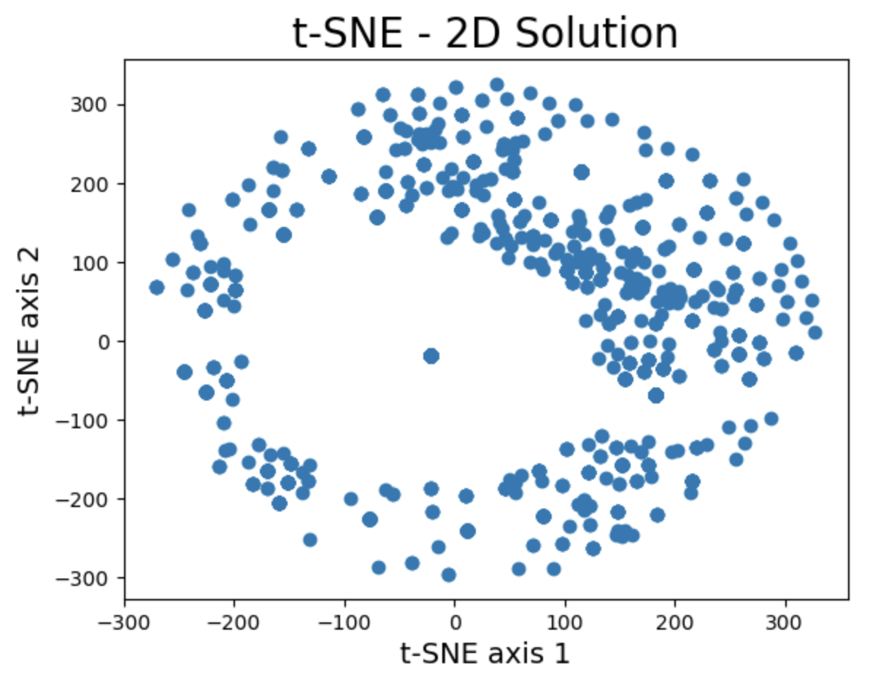
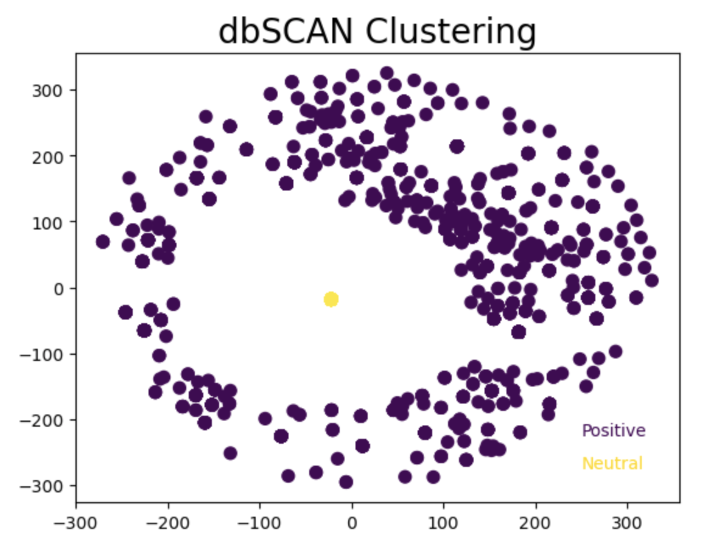
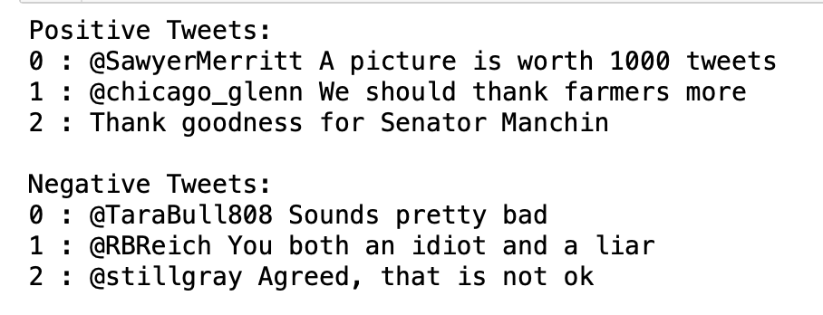

# Elon Musk Tweet Sentiment Analysis

- The project focused on the time period during Musk’s acquisition of Twitter from July 2022 to November 2022.
- Using Natural Language Processing, we apply the necessary unsupervised machine learning and deep learning techniques on the unlabelled Twitter data. 
- With such labeled Tweets, we are able to successfully classify Musk's Tweets for either positive or negative sentiment.
- Going forward, we hope to continue to explore the impact Musk has in other fields like the stock market, regulatory policy, innovation, etc.


## Code and Resources Used

**Python Version:** 3.8.12\
**Packages:** tensorflow, keras, nltk, sklearn, pandas, numpy, matplotlib, scipy, tqdm, datetime\
**Source Reference:** [Kaggle Notebook](https://www.kaggle.com/datasets/gpreda/elon-musk-tweets)


## Description of Repository and Code Structure

#### Repository

- Utilized both Unsupervised clustering and Supervised classification/deep learning ML techniques via Python Notebook
- Uploaded source data file of extracted Elon Musk tweets via Tweety API
- Included images of dimensionality reduction 2D solutions, as well as dbSCAN clusters
- Included example positively and negatively classified tweets
- Included full slideshow presentation outling overall purpose, procedure, evaluation, and conclusion

#### Code Structure

- Loaded Kaggle dataset of Tweety API scared tweets
- Resovled syntax issues using regexNLP techniques (special characters, hashtags, extra white space, etc.)
- TF-IDF Vectorized text to extract words as features into dense matrix
- Performed dimensionality reduction to create 2D solution to represent features (PCA, t-SNE)
- Applied dbSCAN to cluster Tweets (Positive, Negative)
- Built 5 baseline models (Logisitc Regression, SVM, Decision Tree, Random Forest, Sequential Neural Network)
- Evaluated accuracy performance for each model in classifying sentiment 

## Example Commands to Execute Code

- Download the Python Notebook file as well as the "musk_tweets.csv" data file
- Open the notebook in a compatible environment, such as Jupyter Notebook or Google Colab
- Run the code cells in order
- **Note:** installation the following libraries may be necessary and run the additional code:
```
pip install sia
pip install nltk
nltk.download('stopwords')
nltk.download('vader_lexicon')
```

## Results and Observations

#### Dimensionality Reduction and Clustering Solutions

The 2D solutions for the Principal Component Analysis and t-SNE, as well as the dbSCAN output are as follow:
<p align="center">
  
  
  
</p>


#### Example Newly Labeled Tweets

Some examples for the positively and negtively labeled Tweets also follow:
<p align="center">
  
</p>


#### Model Performances

The baseline model accuracies are as follows:
| Model                  | Accuracy |
| ---------------------- | -------- |
| Logistic Regression    | 0.9355   |
| Support Vector Machine | 0.5339   |
| Decision Tree          | 0.8102   |
| Random Forest          | 0.9558   |
| Sequential Dense NN    | 0.8998   |


#### Best Model Parameters/Architecture

The best performing model was the Random Forest. It was tuned on various parameters and values to improve accuracy.
The best performing Random Forest model had the following paramters:

| Parameter         | Range of Values | Value |
| ----------------- | --------------- | ----- |
| n_estimators      | [50, 100, 250]  | 100 |
| max_depth         | [2, 5, 8]       | 8 |
| min_samples_split | [2, 5, 10]      | 5 |

What was interesting was that the model accuracy actually decreased to 0.8229. A possible explanation for this was that it may have accounted for overfitting, hence reducing the accuracy.


#### Most Predictive Features

Some of the vectorized Tweet features that led to positive sentiment labeled tweets follow:
1. absolutely
2. exactly
3. good
4. great
5. interesting
6. like
7. real
8. right
9. work
10. yeah


## Recommendations based on Observations Going Forward

- Apply to stock predictions of Twitter
- Compare to stock value of TSLA and other Musk companies
- See how Tweet sentiment stears direction of Twitter climate
- Analyze prominence in News media
- Capture more, updated data on Musk's recent Tweets
- Analyze Twitter replies to many of Musk's tweets to understand impact from customer perspective


